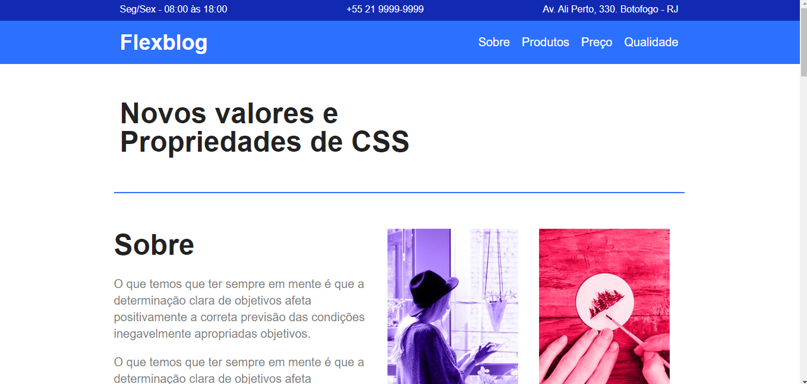

<h1 align="center"> Site com bastante Flexbox </h1>

Origamid - Flexbox

  <a href="#-tecnologias">Tecnologias</a>&nbsp;&nbsp;&nbsp;|&nbsp;&nbsp;&nbsp;
  <a href="#-projeto">Projeto</a>&nbsp;&nbsp;&nbsp;|&nbsp;&nbsp;&nbsp;
  <a href="#memo-licença">Licença</a>

  

 

  

## 🚀 Tecnologias

Esse projeto foi desenvolvido com as seguintes tecnologias:

- HTML  
- CSS
- Git e Github

## 💻 Projeto

Criado um layout responsivo no CSS utilizando apenas as propriedades do Flexbox, nesse projeto você vê max/min-width, media queries e Pseudo classe :nth-of-type.

## :memo: Licença

Esse projeto está sob a licença MIT.
